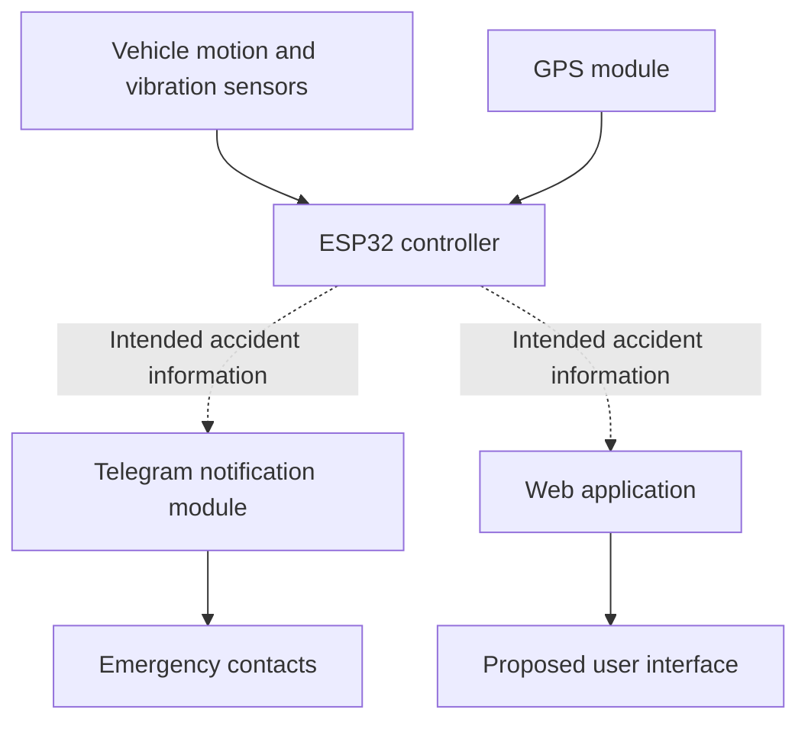

# Sarathi — Proposed System Architecture

## Purpose

This diagram represents the intended architecture of Sarathi. It does not represent a verified, fully operational implementation.

## Conceptual Data Flow

## Component Responsibilities

* **Sensors:** Intended to provide vehicle-motion or vibration information.
* **ESP32:** Intended to process sensor inputs and coordinate system operations.
* **GPS:** Intended to provide geographic location information.
* **Telegram:** Intended to communicate accident-related notifications.
* **Web application:** Intended to display relevant incident information.

## Implementation Note

The diagram describes the proposed design. The complete workflow was not successfully integrated and verified end to end. Dashed arrows represent intended communication, not confirmed working connections.
